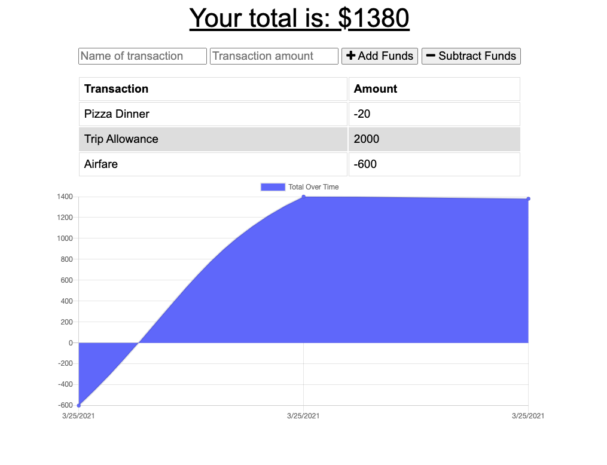

# Budget Tracker

### Version 1.0

 

## License:
 

 

## Description

This application is a budget tracker for employees to use when they are traveling to track their expenses. It has a form set up that allows you to input the expense name and amount, then either hit subtract or add amount. Below the buttons the user will see a list of their expenses and a chart displaying a line chart of their expense history.

The application can be run online or offline. It uses mongodb when it's only along with indexdb for an assist while the network is offline. That way you can still track your additions to your database while you are offline. 

 

## Installation and Instructions

        1. Load Packages:

            npm init
        
        2. Set up webpack files:

            npm run build

        2. Run Application:

            npm start
 

## Requirements

        1. Install Dependencies:

            npm install express
            npm install mongoose
            npm install morgan
            npm install compression
            npm install lite-server
            npm install webpack
            npm intall webpack-cli
            npm install webpack
            npm install webpack-pwa-manifest

        2. Database:

            Install latest version of Mongo and Robo 3T.

 

## Link to application:

https://budgettracker-19.herokuapp.com/

 

## Link to repository:

https://github.com/rwanke14/budgettracker

 

## Screenshots of Application:

 

 

## Additional sources:

Also worked with my study group to better understand how to apply what we learned in class to this readme. Note: Some code may look similar since we generally come out these thinking in the same ways. 

Feedback, brainstorming, and general support to study group:

        1. Young Ji Kim - https://github.com/youjmi
        2. Amir Ashtiany - https://github.com/Alexfit4
        3. Johnnie Simpson - https://github.com/balokdecoy
        5. Frankie Rosado - https://github.com/Franciscorosado09
